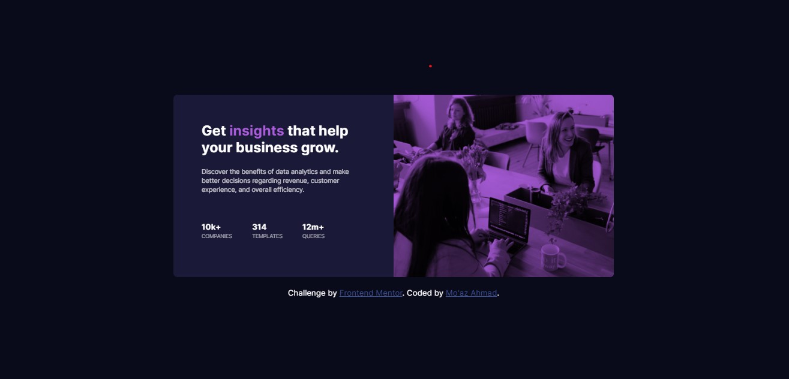

# Frontend Mentor - Stats preview card component solution

This is a solution to the [Stats preview card component challenge on Frontend Mentor](https://www.frontendmentor.io/challenges/stats-preview-card-component-8JqbgoU62). Frontend Mentor challenges help you improve your coding skills by building realistic projects. 

## Table of contents

- [Overview](#overview)
  - [The challenge](#the-challenge)
  - [Screenshot](#screenshot)
  - [Links](#links)
- [My process](#my-process)
  - [Built with](#built-with)
  - [What I learned](#what-i-learned)
  - [Continued development](#continued-development)
  - [Useful resources](#useful-resources)
- [Author](#author)
- [Acknowledgments](#acknowledgments)

## Overview

### The challenge

Users should be able to:

- View the optimal layout depending on their device's screen size

### Screenshot

Add a screenshot of your solution. The easiest way to do this is to use Firefox to view your project, right-click the page and select "Take a Screenshot". You can choose either a full-height screenshot or a cropped one based on how long the page is. If it's very long, it might be best to crop it.

Alternatively, you can use a tool like [FireShot](https://getfireshot.com/) to take the screenshot. FireShot has a free option, so you don't need to purchase it. 

Then crop/optimize/edit your image however you like, add it to your project, and update the file path in the image above.

**Note: Delete this note and the paragraphs above when you add your screenshot. If you prefer not to add a screenshot, feel free to remove this entire section.**

### Links

- Solution URL: [Add solution URL here](https://github.com/MoBlack24/stat-preview-card)
- Live Site URL: [Add live site URL here](https://moblack24.github.io/stat-preview-card/)

## My process

- I built card fully responsive
- I Statrted with desktop version 1440px
- Then mobile version 44

### Built with

- Semantic HTML5 markup
- CSS custom properties
- Flexbox
- CSS Grid in Desktop Version
- BEM Methodology

### What I learned

I tried and used BEM Methodology for the first time, and by the way this my first challenge that i do.
Also i learned how to deploy on github.

### Continued development

I will continue apply for challenges from frontend mentor and i'll try to build a complite website.
And my next challenge will be with sass 

### Useful resources

- [Unique Coderz Academy](https://www.youtube.com/watch?v=MaxFSXIshSA&ab_channel=UniqueCoderzAcademy) - This helped me for applying BEM and deploying on Github. I really liked this pattern and will use it going forward.

## Author

- Frontend Mentor - [@yourusername](https://www.frontendmentor.io/profile/MoBlack24)
- Linkedin - [@Mo'az Ahmad](https://www.linkedin.com/in/mo-az-ahmad-14532b168/)

**Note: Delete this note and add/remove/edit lines above based on what links you'd like to share.**
